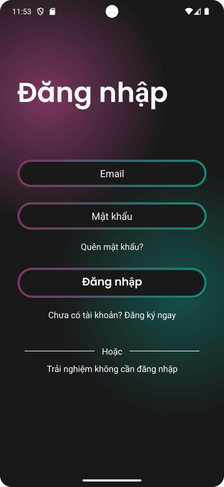
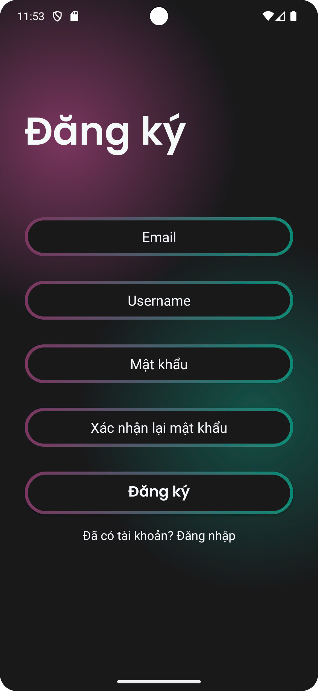
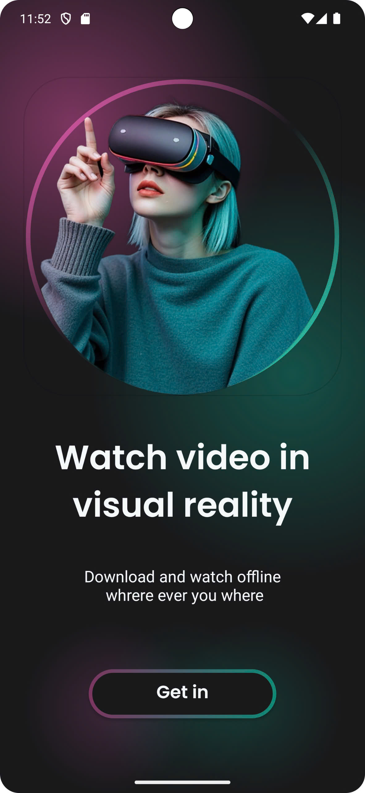
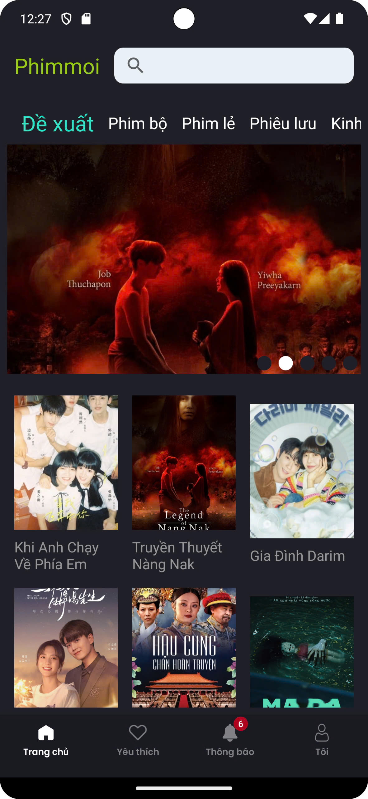
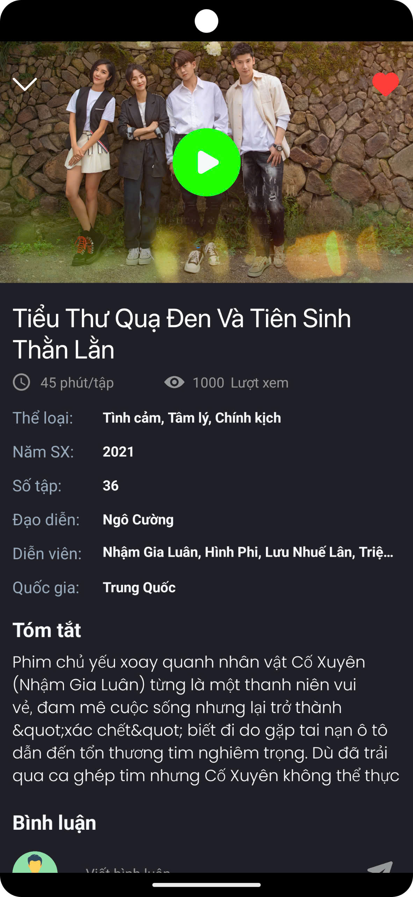
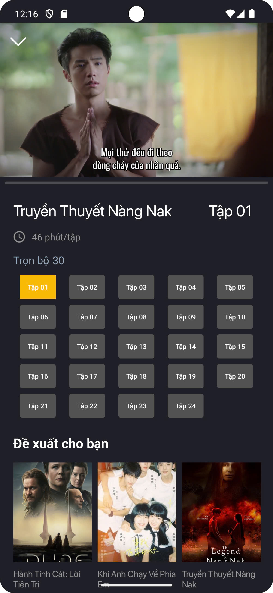
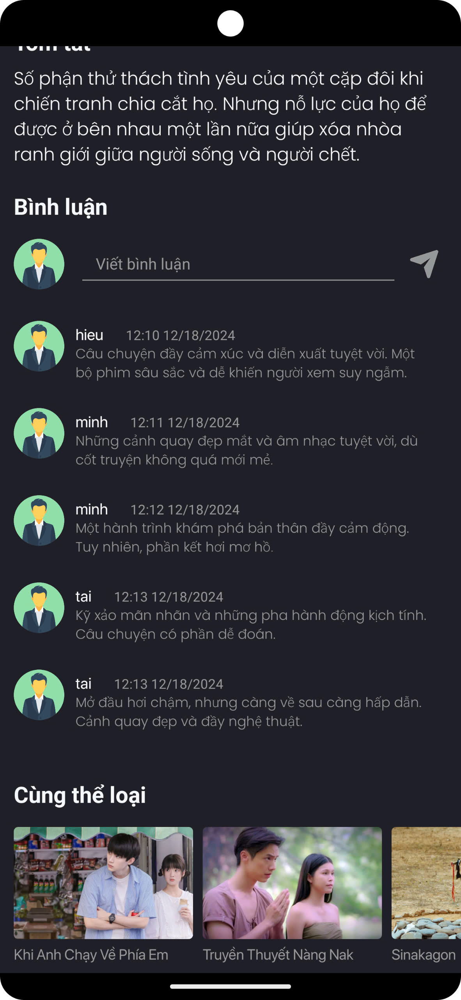
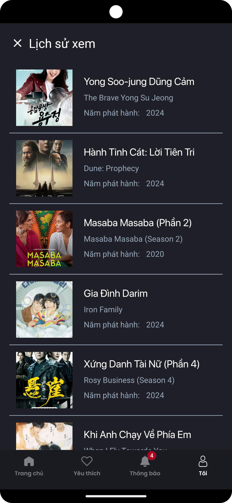

# 🎬 Movies App - Cinematic Discovery

> Một ứng dụng Android hiện đại giúp người dùng khám phá, tìm kiếm và xem thông tin phim, được xây dựng dựa trên kiến trúc MVVM và tích hợp RESTful API.


## 📱 Giới thiệu (Overview)
**Movies App** là dự án demo năng lực lập trình Android, mô phỏng quy trình xây dựng ứng dụng thực tế. Ứng dụng cho phép người dùng đăng ký, đăng nhập, lướt xem các bộ phim thịnh hành, xem chi tiết nội dung, diễn viên và để lại bình luận đánh giá.

## 🛠️ Công nghệ sử dụng (Tech Stack)
Dự án áp dụng các thư viện và kiến trúc chuẩn của Google:
* **Ngôn ngữ:** Kotlin 100%.
* **Kiến trúc:** MVVM (Model - View - ViewModel).
* **Networking:** Retrofit2 & Gson (Kết nối REST API).
* **Xử lý bất đồng bộ:** Coroutines & Flow.
* **Load ảnh:** Glide.
* **Điều hướng:** Navigation Component.
* **UI:** XML, ConstraintLayout, RecyclerView.

## 📸 Giao diện ứng dụng (Screenshots)
Dưới đây là hình ảnh thực tế của ứng dụng:

<p align="center">
  
  
  
  
</p>

<p align="center">
  
  
  
  
</p>

## ✨ Tính năng chính (Key Features)
1.  **Xác thực người dùng:** Đăng nhập, Đăng ký tài khoản, Quản lý thông tin cá nhân (Profile).
2.  **Khám phá:** Hiển thị danh sách phim theo danh mục (Trending, Popular, Now Playing).
3.  **Chi tiết phim:** Xem nội dung tóm tắt, trailer, danh sách diễn viên.
4.  **Tương tác:** Chức năng bình luận và đánh giá phim.
5.  **Tìm kiếm:** Tìm kiếm phim theo từ khóa.

## 🔗 Backend Integration
Ứng dụng kết nối với hệ thống Backend Services được phát triển riêng (Spring Boot):

| Service | Repository Link |
| :--- | :--- |
| **User Service** | [Movie_BE_Spring](https://github.com/MrCuong11/Movie_BE_Spring) |
| **Admin Service** | [Movie-Admin](https://github.com/GiaCng/Movie-Admin.git) |

## ⚙️ Cài đặt (Installation)
1. Clone dự án về máy:
   ```bash
   git clone [https://github.com/anicca3S84/movies-app.git](https://github.com/anicca3S84/movies-app.git)
